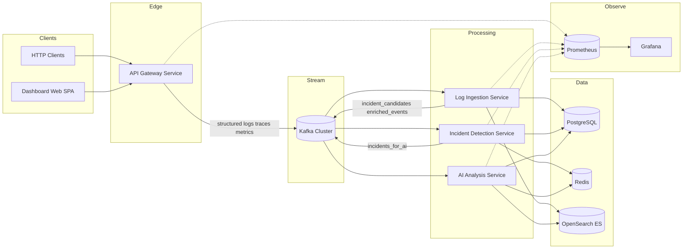

# High-Level Design (HLD)

<!--
  Ownership: Platform Architecture
  Audience: Staff+ review, onboarding SDE-2 candidates, auditors of “resume project” realism
-->

## 1. Purpose and Scope

**Why this document:** HLD freezes *what* we build before *how* (LLD/modules). It maps business capabilities to bounded contexts and the data plane so later code cannot drift casually.

**In scope:** API gateway instrumentation, asynchronous log/trace pipeline, incident detection, AI-assisted RCA and similarity search, dashboard, and unified observability of the platform itself.

**Out of scope (initial phases):** Full multi-tenant SaaS billing, global multi-region active-active, bespoke ML training platform (we use pragmatic anomaly rules + embeddings/LLM where justified).

---

## 2. Goals and Non-Functional Requirements (NFRs)

| NFR | Target (demo / MVP stretch) | Design implication |
|-----|-------------------------------|---------------------|
| Ingest volume | Design for **≥50k gateway events/day** (burst-friendly) | Partitioned Kafka topics, horizontally scaled consumers |
| Latency — hot path | API gateway adds **low ms** overhead | Sampling, async publish, reactive I/O |
| Latency — analytics | Incident visibility **near real-time** (seconds–minutes) | Stream processing vs batch tradeoff documented in LLD |
| Availability | Degrade gracefully when AI or search is down | Feature flags; rule-only incident path |
| Security | JWT validation at edge; least privilege inward | Gateway as policy enforcement point |
| Operability | SLO-oriented metrics per service | Prometheus + Grafana + RED/USE dashboards |
| Cost control (AI) | No “LLM every log line” anti-pattern | Gating pipeline in ai/ docs |

---

## 3. System Context

**Actors:**

- **Client applications** invoke APIs through **API Gateway Service**.
- **Operators / engineers** use **Dashboard UI** for traffic, incidents, traces, RCA.
- **Automations** may call REST/Webhooks from **Incident / Notification** paths (later).

**External systems:**

| System | Usage |
|--------|--------|
| **Kafka** | Durable telemetry & domain event bus |
| **PostgreSQL** | Source of truth for incidents, classifications, RCA artefacts, tenancy metadata |
| **Redis** | Rate limits, caches, similarity embedding cache, ephemeral scoring |
| **OpenSearch / Elasticsearch** | Full-text search, aggregations over raw gateway events |
| **Prometheus/Grafana** | Platform metrics |
| **OpenTelemetry** | Traces/logs/metrics propagation (collector TBD in LLD/DEPLOY) |
| **LLM provider** (OpenAI **or** Ollama/Llama3) | RCA narrative, explanations, similarity assist |

---

## 4. Container / Logical View (C4-Lite)

---

## 5. Principal Data Flow (Happy Path)

1. **Request** enters **API Gateway** with correlation/trace context.
2. Gateway records **structured JSON** telemetry (timing, outcome, route, user claims summary, sampled body hash — **never** wholesale bodies by default).
3. **Kafka producer** (async, back-pressured) emits `gateway-access-v1` (see streaming docs).
4. **Log Ingestion** consumes → **normalizes**, **enriches** (service map hints, geo, severity), persists **immutable raw** reference in ES/OS, writes **canonical** rows/projection in Postgres for incident linkage.
5. **Detection** consumes enriched stream or projections → applies **thresholds**, **latency spike rules**, **rate anomalies**, simple **failure clustering**.
6. On incident open/update, bounded context emits `incidents-v1` events; **AI Analysis** summarizes, proposes RCA hypotheses, computes **prioritization score** and **historical similarity** pointers.
7. **Dashboard** polls/subscribes (WebSocket optional in later phase) for incident feed and renders traces/metrics sourced from Prometheus + trace backend.

Failure and retry overlays: [FAILURE_HANDLING.md](./FAILURE_HANDLING.md), [../streaming/DLQ_STRATEGY.md](../streaming/DLQ_STRATEGY.md).

---

## 6. Bounded Contexts (DDD-Inspired)

| Context | Responsibility | Canonical aggregates |
|---------|----------------|----------------------|
| **Gateway Telemetry** | Capture, correlate, simulate failures | Access event, correlation ID |
| **Ingestion** | Durability + enrichment | Enriched telemetry, ingestion checkpoints |
| **Incident** | Lifecycle, severity, RCA linkage | Incident, IncidentEvent, RCAReport |
| **AI Insights** | LLM artefacts, embeddings metadata | RCA summary, similarity matches (references only) |

**Anti-corruption:** Detection does not depend on frontend models; Dashboard uses stable **read models**/APIs versioned (`/api/v1/...`).

---

## 7. Cross-Cutting Concerns

| Concern | Approach |
|---------|----------|
| **Correlation** | `X-Correlation-Id` (client optional) + W3C `traceparent` |
| **Idempotency** | Deterministic IDs for derived writes; ingestion uses upsert keys (LLD) |
| **Secrets** | K8s secrets / Docker secrets locally; never commit |
| **PII** | Redact/tokenize structured fields before Kafka where applicable |

---

## 8. Phased Delivery (Aligned with MASTER Brief)

| Phase | Outcome |
|-------|---------|
| 1 | This documentation baseline + contracts |
| 2 | Compose stack: Kafka, PG, Redis, ES, Prometheus, Grafana |
| 3 | Gateway + producer |
| 4 | Ingestion + persistence |
| 5 | Detection + AI |
| 6 | Dashboard |
| 7 | Deep observability (OTel exporter wiring, SLOs) |
| 8 | K8s + CI/CD hardening |

---

## 9. Key Tradeoffs (Executive Summary)

| Decision | Upside | Downside |
|----------|--------|----------|
| **Kafka as spine** | Replay, buffering, loose coupling | Ops complexity locally |
| **Postgres + ES** | OLTP correctness + search ergonomics | Dual-write discipline |
| **Python AI sidecar** | Fast iteration on LangChain | Polyglot CI matrix |
| **Gateway-centric capture** | Consistent enforcement | Misses east-west unless extended later |

Formal ADR linkage: [../tracking/DECISION_LOG.md](../tracking/DECISION_LOG.md).

---

## 10. Related Documents

- [LLD.md](./LLD.md) — component-level design
- [SERVICE_BOUNDARIES.md](./SERVICE_BOUNDARIES.md)
- [EVENT_DRIVEN_ARCHITECTURE.md](./EVENT_DRIVEN_ARCHITECTURE.md)
- [SEQUENCE_DIAGRAMS.md](./SEQUENCE_DIAGRAMS.md)
