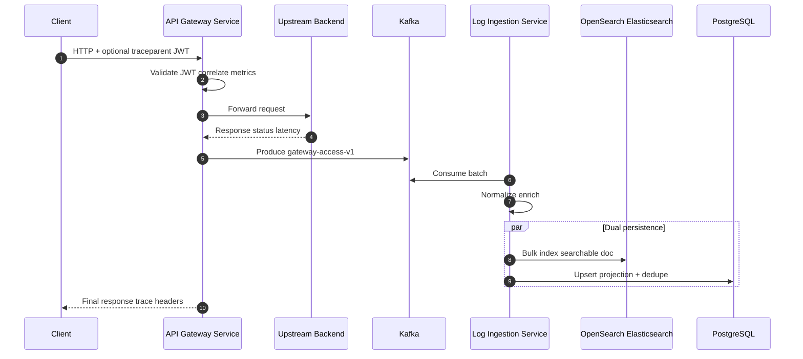
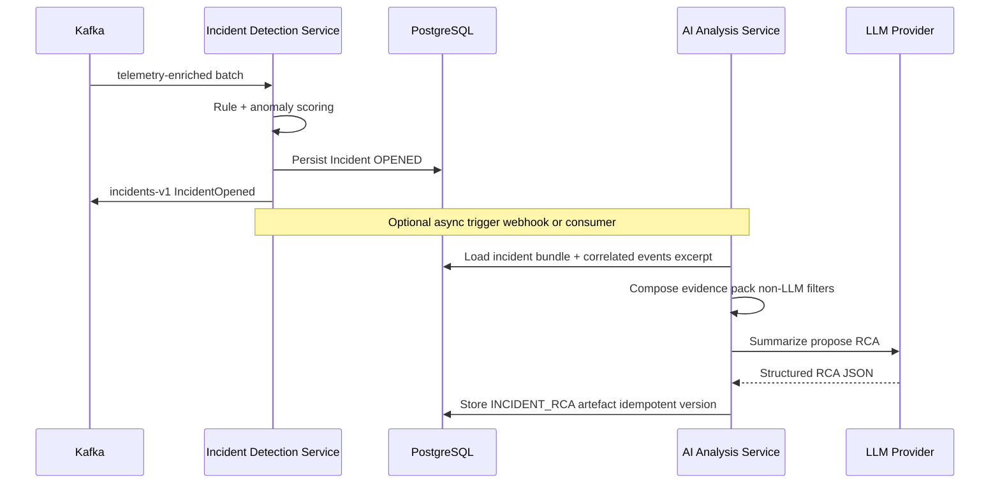
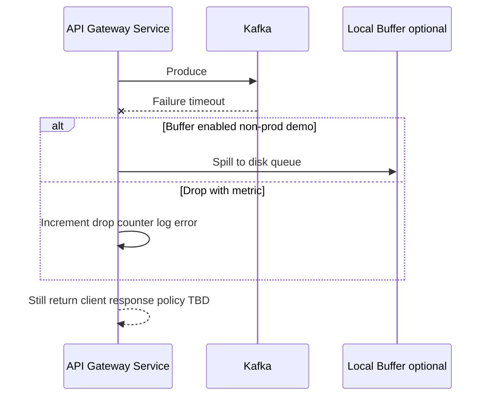
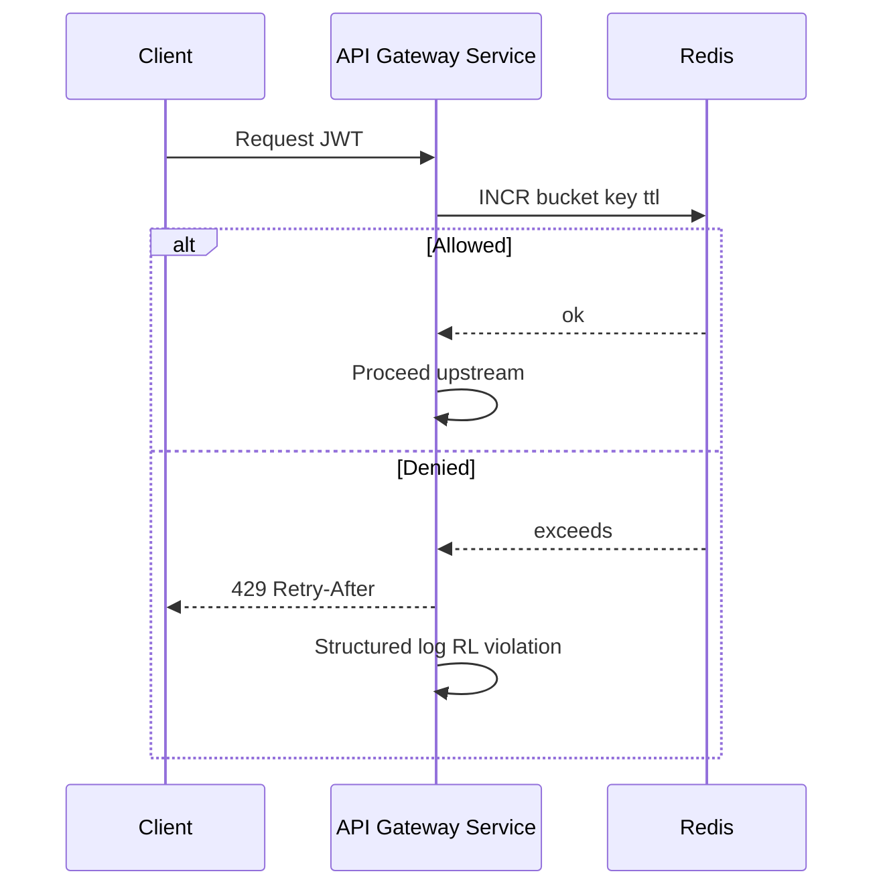

# Sequence Diagrams

<!--
  Ownership: Platform Architecture
  Note: Diagrams use Mermaid; render in GitHub or compatible viewers.
-->

## 1. Happy Path — Request to Searchable Telemetry

---

## 2. Incident Open + RCA (Gated AI)

---

## 3. Failure — Kafka Temporarily Unavailable

Policy (drop vs buffer) must be explicit per environment — see [FAILURE_HANDLING.md](./FAILURE_HANDLING.md).

---

## 4. Rate Limit Breach

---

## Related

- [HLD.md](./HLD.md)
- [FAILURE_HANDLING.md](./FAILURE_HANDLING.md)
